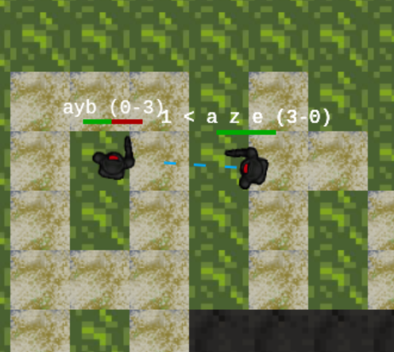
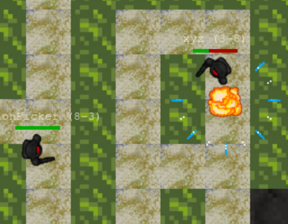

# simplified multiplayer web infantry (in progress)

next to-do:
- move handlers to objects
- game-scene.ts full menu object w/ callbacks
- game-scene.ts teleporter object
- performance?
- rethink controls 
- and finally, 1 proper zone file instead of current 2 file networking mess
- a real mini-zone using above zone file format

